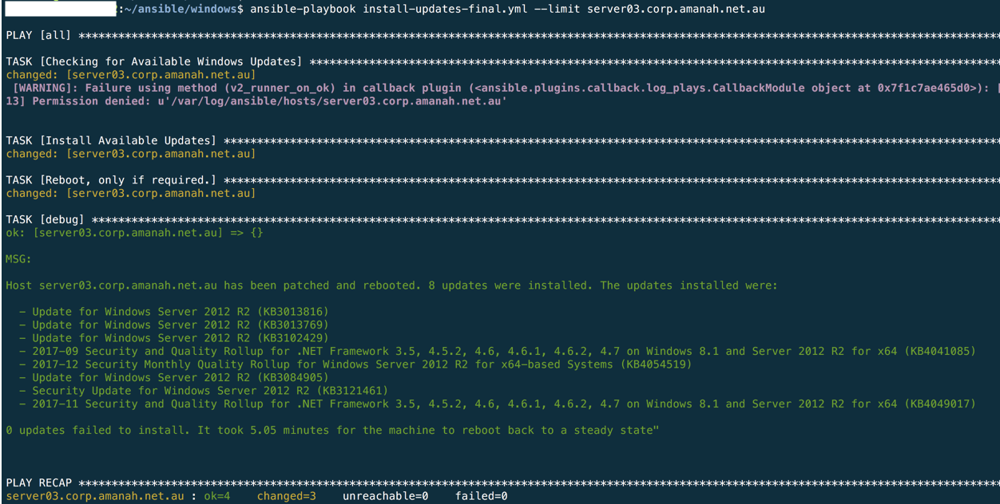

For a given list of hosts, the following playbook will check for and install all available updates. This playbook will also reboot the host and output a summary of the patch process upon completion.

As a pre-requisite, ensure the ANSIBLE_STDOUT_CALLBACK=debug environment variable is set on the Ansible control server; without this, the output will not display in a consistent manner. To do so, you can set the environment variable within your .bashrc profile;

1. `cd` to your home directory
2. `vi .bashrc`
3. add `export ANSIBLE_STDOUT_CALLBACK=debug` as a new line
4. save and exit

You will need to logoff and back on for this to appear; you can check by `printenv | grep ANSIBLE`

Example run and output shown below;

`ansible-playbook install-updates.yml`

